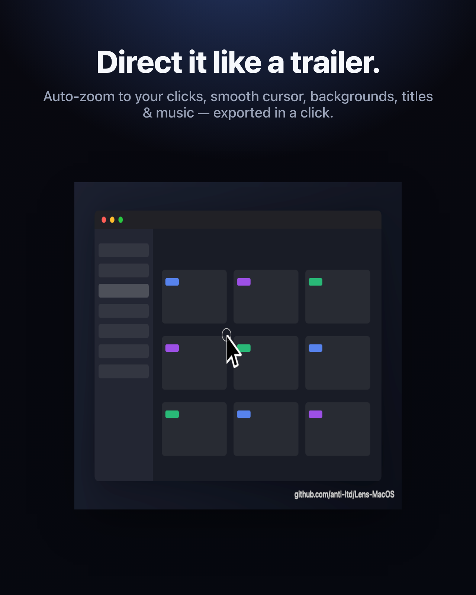
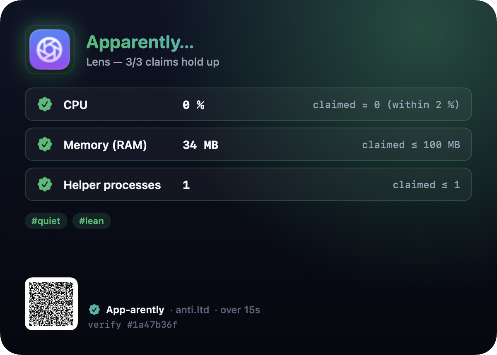

<div align="center">


<br>


<br><br>


# Lens

**Screenshots and cinematic screen recordings for your Mac.**


[](LICENSE.md)


`capture · annotate · record · direct`

</div>

---

> Inspired by [Shottr](https://shottr.cc/) and [Screen Studio](https://screen.studio/) — the precise screenshot tool *and* the cinematic screen recorder, in one menu-bar app you own. No external editor round-trip, no cloud, no subscription.

---

## Get the compiled binary

A signed, notarized build is available for purchase at **[anti.ltd/lens](https://anti.ltd/lens)**.

Use discount code **`READTHESOURCE`** at checkout for a discount — because you found the source.

---

## Screenshots

<div align="center">
 
</div>

<div align="center">
 
</div>

---

## Performance

<div align="center">

</div>

> Generated by `appstage art lens` using [App-arently](../app-arently).

---

## What it is

Lens is a menu-bar app that covers the whole arc from *grab* to *ship*:

- **Screenshots** — fast, repeatable captures locked to a ratio or exact pixel size, plus a full annotation editor with backgrounds, scrolling capture and OCR.
- **Screen recording** — full screen, a region, or a window, with optional system audio and mic.
- **Lens Studio** — turn a raw recording into a polished, App-trailer-style video: auto-zoom that follows your clicks, a cinematic cursor, beautiful backgrounds, keystroke captions, a webcam bubble, title cards, background music, and silence removal — then export MP4 or GIF. Stitch several recordings into one with a project.

Left-click the menu-bar icon for the capture menu, right-click for settings. Every capture mode has a global hotkey. Built natively in Swift, AppKit and SwiftUI for macOS 14+: pixels from **ScreenCaptureKit**, OCR from **Vision**, compositing from **Core Image**, video from **AVFoundation** — no Electron, no helper processes, no background daemons, no network.

---

## Capture modes

| Mode | Behaviour | Default hotkey |
|------|-----------|----------------|
| **Area** | Drag a rectangle. Ratio-locked live when the active preset pins one. | ⌃⇧⌘4 |
| **Window** | Highlight and click a window; captured tightly via ScreenCaptureKit. | ⌃⇧⌘5 |
| **Full screen** | The whole display under the pointer. | ⌃⇧⌘3 |
| **Scrolling** | Auto-scrolls and stitches a long page / chat / document into one image. | ⌃⇧⌘6 |
| **Color picker** | A magnifier loupe; click copies the hex value. | ⌃⇧⌘X |
| **Record screen** | Toggle a video recording — full screen, a region, or a window. | ⌃⇧⌘V |

Every hotkey is rebindable in *Settings → Capture*, and the menu items mirror whatever is configured.

---

## Set the frame once

A **preset** pins a frame constraint — a locked **aspect ratio** (`16:9`, `1:1`, `9:16`…) or **exact output pixels** (`1920×1080`, `1200×630` Open Graph, `1280×800` Mac App Store). Set one, and every capture comes out matching: the area overlay locks to the ratio while you drag, window/full-screen grabs are centre-cropped, and pixel presets resize to the exact size on export. Build your own for docs, social and ads.

## Beautiful backgrounds

Every preset can carry a **backdrop** — solid colour, gradient, or **transparent** cut-out, with padding, rounded corners and a drop shadow. Pick *Clean*, *Marketing*, or tune your own.

## Annotation editor

Mark up any capture on a fit-to-window canvas; annotations bake in only on export.

- **Shapes** — arrow, line, rectangle, ellipse, freehand.
- **Emphasis** — highlight, spotlight, numbered steps.
- **Hide** — pixelate, blur, or solid redaction burned into the pixels.
- **Text**, undo/redo, live backdrop preview.
- **Export** — save, copy, pin, or **OCR** the text to the clipboard.

## Scrolling, OCR, pin & pick

- **Scrolling capture** drives real scroll-wheel events and stitches the frames by detecting their vertical overlap.
- **Text recognition (OCR)** pulls selectable text — or decodes QR / barcodes — on-device via Vision.
- **Pin** floats a capture as an always-on-top reference window.
- **Color picker** freezes the display under a magnifier loupe; click copies the hex.

## Rapid capture & collage

Set the destination to **Add to Tray** and captures collect instead of interrupting you — grab a burst, then open the **Gallery** to edit, export, or **Make Collage** (a grid with adjustable columns, spacing, padding, rounded tiles and a background — live preview, then opens in the editor).

## Screen recording

Press **⌃⇧⌘V** to start and again to stop; a floating pill shows a pulsing dot, a timer and a stop button. Each recording is saved as a self-contained session folder under `Lens Recordings/` (the raw video + an event track).

- **Source** — full screen, a dragged region, or a window.
- **Frame rate** (15 / 24 / 30 / 60) and **codec** (H.264 / HEVC).
- **System audio** (macOS 13+) and **microphone** (macOS 15+), each optional.
- **Cinematic cursor** captured independently of the screenshot cursor setting.

---

## Lens Studio — direct it like a trailer

This is where Lens stands apart. Recording captures the raw screen **plus an event track** (cursor path, clicks, keystrokes, and — via Accessibility — the caret while you type). The Studio render then turns that into a polished video, all editable per-recording and reproducible (`studio.json` in the session folder):

- **Scene framing** — drop the window onto a gradient / solid / wallpaper background with padding, rounded corners, a drop shadow, optional macOS-window or browser chrome, a subtle 3D tilt, and an aspect preset (source / 16:9 / 1:1 / **9:16** / 4:3).
- **Auto-zoom camera** — a zero-phase-smoothed virtual camera that punches in toward your clicks and **typing** (it follows the caret, not the mouse), follows along, then eases back out when idle. Pick a **Smooth** or **Punchy** ("pop") easing.
- **Cursor cinema** — an enlarged, smoothed cursor with click ripples, an optional spotlight, and hide-when-idle.
- **Keystroke overlay** — pressed shortcuts (⌘C, ⌃⇧4…) as lower-third keycaps.
- **Webcam bubble** — a rounded picture-in-picture from your camera.
- **Logo bug** — a corner wordmark watermark.
- **Auto-remove silence** — collapse long idle stretches to a short beat.
- **Background music** — mixed under the recording, ducked so your own audio stays on top.
- **Intro / outro title cards** and **text / image layers** placed anywhere on the timeline, with fade-in/out and motion.

The **Studio editor** (menu → *Open in Studio Editor…*) gives a live, scrubbable preview with every knob as a control, trim handles, and one-click export to **MP4** or **GIF**. The **project window** (*New Studio Project…*) stitches several recordings end-to-end with an optional **cross-dissolve** between clips.

---

## How it works

| File | Role |
|------|------|
| [`LensApp.swift`](Sources/Lens/LensApp.swift) | `@main` entrypoint, scene declaration, arg routing |
| [`AppDelegate.swift`](Sources/LensUI/AppDelegate.swift) | Menu-bar item, capture/record/studio menu, single-instance lock |
| [`CaptureController.swift`](Sources/LensUI/CaptureController.swift) | Orchestrates every mode → engine → compose → destination; recording lifecycle; permissions |
| [`CaptureEngine.swift`](Sources/LensCore/CaptureEngine.swift) | ScreenCaptureKit still capture (display / window / region) |
| [`ScrollingCapture.swift`](Sources/LensCore/ScrollingCapture.swift) | Scroll-and-stitch with overlap detection |
| [`Compositor.swift`](Sources/LensCore/Compositor.swift) | Frame-constraint crop/resize, annotation baking, backdrops |
| [`CollageComposer.swift`](Sources/LensCore/CollageComposer.swift) | Grids a batch of captures into one collage |
| [`TextRecognizer.swift`](Sources/LensCore/TextRecognizer.swift) | Vision OCR + QR / barcode reading |
| [`ScreenRecorder.swift`](Sources/LensCore/ScreenRecorder.swift) | Video recording (SCStream → AVAssetWriter) + audio |
| [`WebcamRecorder.swift`](Sources/LensCore/WebcamRecorder.swift) | Camera capture for the PiP bubble |
| [`RecordingEvents.swift`](Sources/LensCore/RecordingEvents.swift) · [`RecordingTracker.swift`](Sources/LensUI/RecordingTracker.swift) · [`AccessibilityProbe.swift`](Sources/LensUI/AccessibilityProbe.swift) | The event track (cursor / clicks / keys / caret) |
| [`StudioRenderer.swift`](Sources/LensCore/StudioRenderer.swift) | The render spine: decode → transform → encode, trim, post-steps |
| [`SceneCompositor.swift`](Sources/LensCore/SceneCompositor.swift) | Background, rounded window, shadow, chrome, 3D tilt |
| [`StudioComposer.swift`](Sources/LensCore/StudioComposer.swift) | Auto-zoom camera, cursor cinema, keystrokes, webcam PiP, watermark, layers |
| [`SilenceDetector.swift`](Sources/LensCore/SilenceDetector.swift) · [`SilenceCutter.swift`](Sources/LensCore/SilenceCutter.swift) | Idle-gap detection + cutting |
| [`MusicMixer.swift`](Sources/LensCore/MusicMixer.swift) | Background music + ducking |
| [`TitleCardRenderer.swift`](Sources/LensCore/TitleCardRenderer.swift) · [`VideoConcatenator.swift`](Sources/LensCore/VideoConcatenator.swift) | Intro/outro cards + concat |
| [`StudioDocument.swift`](Sources/LensCore/StudioDocument.swift) · [`StudioLayer.swift`](Sources/LensCore/StudioLayer.swift) · [`StudioProject.swift`](Sources/LensCore/StudioProject.swift) | Per-recording config, layers, multi-clip projects |
| [`ProjectRenderer.swift`](Sources/LensCore/ProjectRenderer.swift) | Multi-clip render + cross-dissolve transitions |
| [`StudioEditor/`](Sources/LensUI/StudioEditor) | The Studio editor + project windows (live preview, controls, export) |
| [`LensSettings.swift`](Sources/LensCore/LensSettings.swift) | Settings + presets + hotkeys + Studio defaults |

---

## Privacy

Everything runs on this Mac. Captures, recordings, OCR and all compositing use Apple's on-device frameworks (ScreenCaptureKit, Vision, Core Image, AVFoundation). Settings, presets and Studio docs live in `UserDefaults` / the session folder. **No analytics · no tracking · no ads · no accounts · no network.**

Permissions (status + grant buttons in *Settings → About*):

- **Screen Recording** — to capture any pixels / video. Triggered on first capture.
- **Accessibility** — for global hotkeys, scrolling capture, and the typing-aware caret probe. Prompted on first launch.
- **Microphone** — *only* if you turn on mic recording. Off by default.
- **Camera** — *only* if you turn on the webcam bubble. Off by default.

---

## Building

Requires **macOS 14+**, **Swift 5.10**, and the Xcode command-line tools.

Lens depends on **[iUX-MacOS](../iUX-MacOS)** — our shared UX layer (settings popover shell, menu-bar host, overlay windows) — via a local path. Check it out as a sibling directory:

```
Projects/
├── lens-macos/  ← this repo
└── iUX-MacOS/   ← shared macOS UX library
```

```bash
git clone git@github.com:anti-ltd/iUX-MacOS.git ../iUX-MacOS   # one-time

make run        # build, bundle Lens.app, launch it
make bundle     # assemble Lens.app under build/ (signed)
make build      # just compile the release binary
make icon       # rebuild AppIcon.icns from the procedural renderer
make test       # swift test
make dmg        # drag-to-install disk image of the local bundle
make clean      # remove .build/ and build/
```

No third-party package dependencies — only the first-party [iUX-MacOS](../iUX-MacOS) sibling. Everything else is system frameworks (AppKit, SwiftUI, ScreenCaptureKit, Vision, Core Image, AVFoundation, ImageIO, ApplicationServices).

Lens needs **Screen Recording** and **Accessibility** (and Microphone / Camera only for those features). macOS ties those grants to the app's signing identity, and an ad-hoc signature changes on every rebuild — so to make the grants stick, create a reusable self-signed `Lens Dev` certificate once (Keychain Access → Certificate Assistant → Create a Certificate → type *Code Signing*); `make bundle` / `make run` pick it up automatically.

---

## Marketing media (appstage)

Lens implements the `--appstage <state>` driver protocol, so the workspace's appstage pipeline builds it, seeds demo state in an isolated preferences suite, and renders the popover / editor / Studio frame into banner, OG and App-Store assets automatically:

```bash
cd ../appstage && node bin/appstage.mjs build lens
```

---

<div align="center">

© 2026 Anti Limited. Released under the [Counter-Limitation License (CLL) v1.2](LICENSE.md).

</div>
