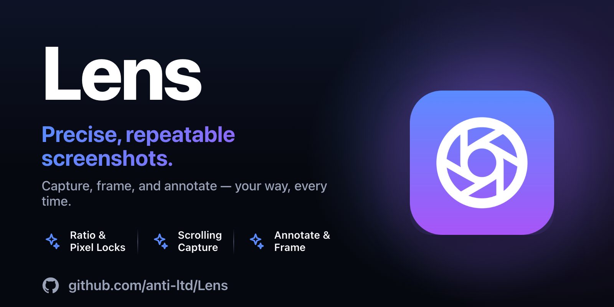
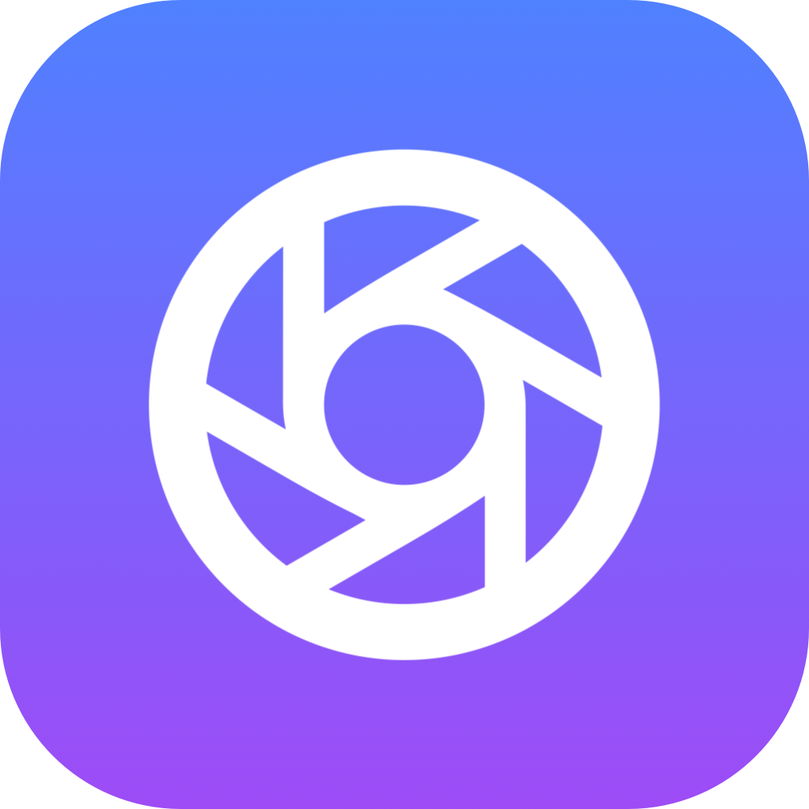
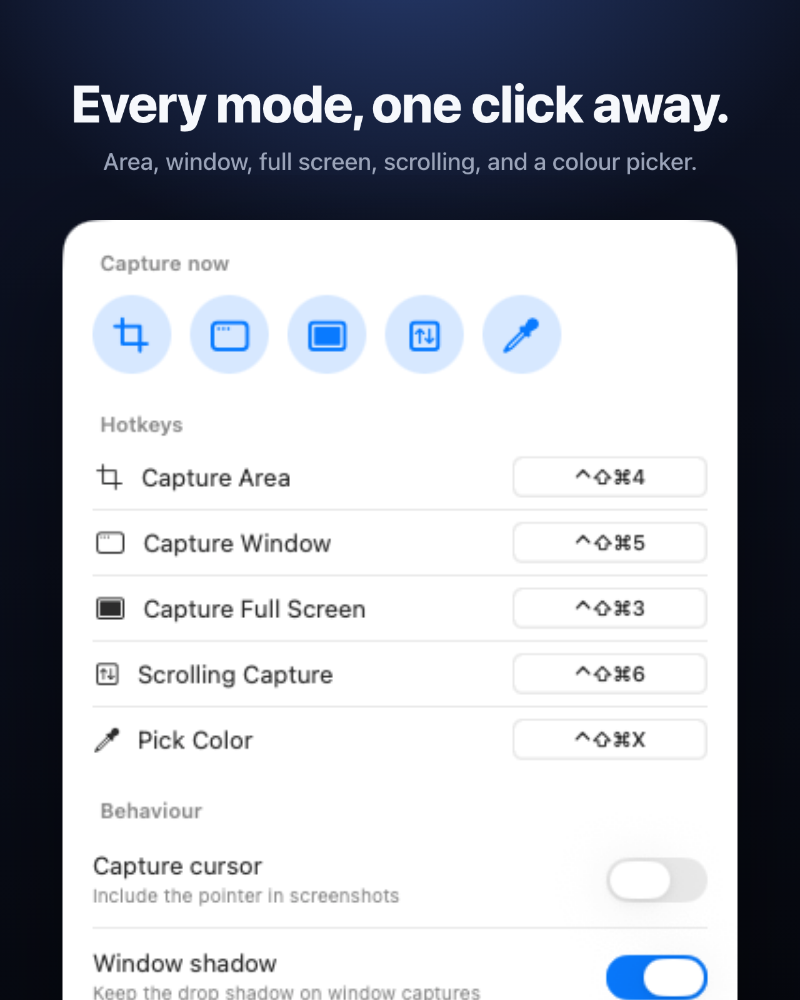
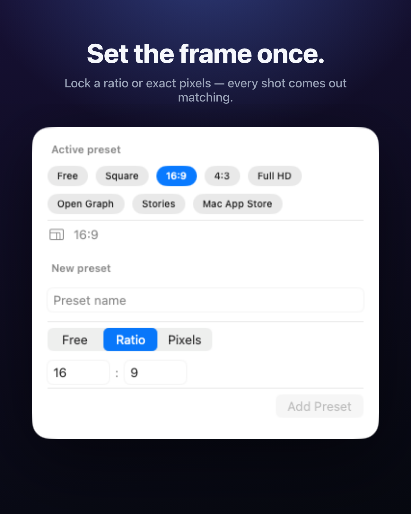
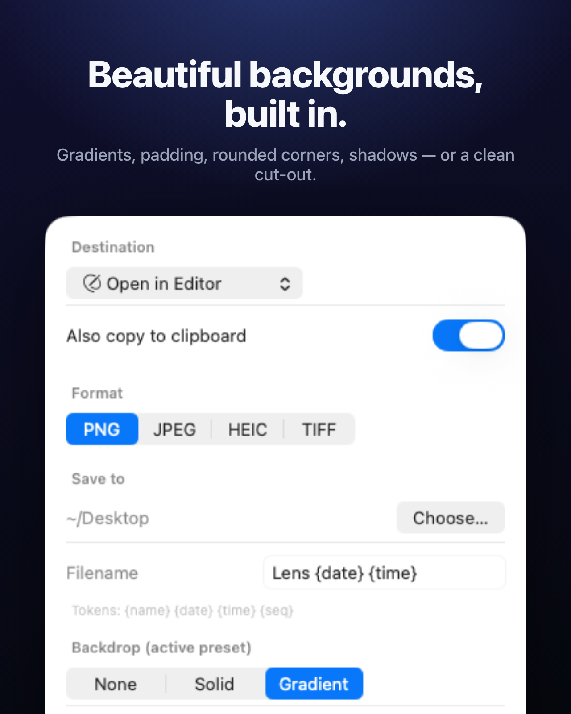
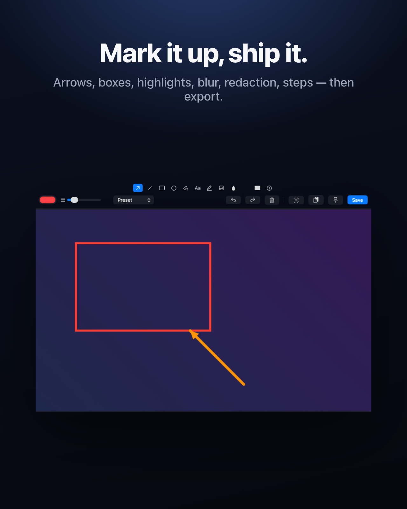

<div align="center">



<br>


<br><br>



# Lens

**Precise, repeatable screenshots for your Mac.**


[](LICENSE.md)


`area · window · scroll · annotate`

</div>

---

> Inspired by [Shottr](https://shottr.cc/) and ratio-locked capture tools like Framéd — one menu-bar app that does both halves: quick, repeatable grabs locked to a frame *and* a full annotation studio. No editor round-trip, no cloud, no clutter.

---

## Get the compiled binary

A signed, notarized build is available for purchase at **[anti.ltd/lens](https://anti.ltd/lens)**.

Use discount code **`READTHESOURCE`** at checkout for a discount — because you found the source.

---

## Screenshots

<div align="center">
 
</div>

<div align="center">
 
</div>

---

## What it is

Lens is a menu-bar screenshot utility that does the two things competitors split between separate apps: **fast, repeatable captures** locked to a ratio or exact pixel size, *and* **deep, in-depth shots** with annotations, backgrounds, scrolling capture and OCR.

It lives in the menu bar — left-click for the capture menu, right-click for the settings popover. Every mode has a global hotkey. Grab a region, a window, a whole display, or auto-scroll a long page into one tall image; mark it up; wrap it in a backdrop; and save, copy, or pin it.

Built natively in Swift, AppKit and SwiftUI for macOS 14+. Pixels come from **ScreenCaptureKit**, OCR from **Vision**, compositing from **Core Image** — no Electron, no helper processes, no background daemons, no network.

---

## Capture modes

| Mode | Behaviour | Default hotkey |
|------|-----------|----------------|
| **Area** | Drag a rectangle. Ratio-locked live when the active preset pins one. | ⌃⇧⌘4 |
| **Window** | Highlight and click a window; captured tightly via ScreenCaptureKit. | ⌃⇧⌘5 |
| **Full screen** | The whole display under the pointer. | ⌃⇧⌘3 |
| **Scrolling** | Auto-scrolls and stitches a long page / chat / document into one image. | ⌃⇧⌘6 |
| **Color picker** | A magnifier loupe; click copies the hex value. | ⌃⇧⌘X |

Every hotkey is rebindable in *Settings → Capture*, and the menu items mirror whatever is configured. Defaults layer ⌃ on top of the macOS ⌘⇧3/4/5 set so they never collide.

---

## Set the frame once

The repeatable half. A **preset** pins a frame constraint — a locked **aspect ratio** (`16:9`, `1:1`, `9:16`…) or **exact output pixels** (`1920×1080`, `1200×630` Open Graph, `1280×800` Mac App Store). Set one, and every capture comes out matching:

- the area overlay **locks to the ratio while you drag**,
- window and full-screen grabs are **centre-cropped** to it,
- pixel presets **resize to the exact size** on export.

Build your own presets for docs, social and ads, and switch between them in a click. No editor round-trip to make a batch of shots line up.

---

## Beautiful backgrounds, built in

Every preset can carry a **backdrop** that wraps the capture for presentation:

- **Fill** — solid colour, linear gradient, or **transparent** for a clean cut-out.
- **Padding** — breathing room between the image and the edge.
- **Rounded corners** + a soft **drop shadow**.

Pick *Clean*, *Marketing*, or a per-preset backdrop in the editor; transparent + zero padding gives you a bare cut-out for READMEs.

---

## Annotation editor

Send any capture to the editor and mark it up on a fit-to-window canvas. Annotations are dragged straight onto the image and baked in only on export, so what you draw is exactly what you save.

- **Shapes** — arrow, line, rectangle, ellipse, freehand.
- **Emphasis** — highlight, spotlight (dims everything else), numbered steps.
- **Hide** — pixelate, gaussian blur, or solid redaction burned into the pixels.
- **Text** — pick a colour and weight.
- **Undo / redo**, clear, and a live backdrop preview.
- **Export** — save to your folder, copy to the clipboard, pin to the screen, or **OCR** the text to the clipboard.

---

## Scrolling, OCR, pin & pick

- **Scrolling capture** drives real scroll-wheel events and stitches the frames by detecting the vertical overlap between them — works on any scrollable surface, not just web views.
- **Text recognition (OCR)** pulls selectable text — or decodes QR / barcodes — from any capture, on-device via Vision.
- **Pin** floats a capture as an always-on-top, draggable reference window.
- **Color picker** freezes the display under a magnifier loupe; click copies the hex.

Finished captures route to your choice of destination — **open in the editor**, **save to a folder**, **copy to the clipboard**, or **pin** — with an optional always-copy-to-clipboard and a templated filename (`{name} {date} {time} {seq}`).

---

## How it works

| File | Role |
|------|------|
| [`LensApp.swift`](Sources/Lens/LensApp.swift) | `@main` entrypoint, scene declaration, arg routing |
| [`AppDelegate.swift`](Sources/LensUI/AppDelegate.swift) | Menu-bar item, capture menu, lifecycle, single-instance lock |
| [`CaptureController.swift`](Sources/LensUI/CaptureController.swift) | Orchestrates each mode → engine → compose → destination; permissions |
| [`CaptureEngine.swift`](Sources/LensCore/CaptureEngine.swift) | ScreenCaptureKit capture (display / window / region), retina sizing |
| [`ScrollingCapture.swift`](Sources/LensCore/ScrollingCapture.swift) | Scroll-and-stitch with overlap detection |
| [`Compositor.swift`](Sources/LensCore/Compositor.swift) | Frame-constraint crop/resize, annotation baking, backdrops |
| [`TextRecognizer.swift`](Sources/LensCore/TextRecognizer.swift) | Vision OCR + QR / barcode reading |
| [`Preset.swift`](Sources/LensCore/Preset.swift) | Frame constraints (ratio / pixel locks) and the built-in set |
| [`LensSettings.swift`](Sources/LensCore/LensSettings.swift) | Settings + presets + hotkeys, persisted to `UserDefaults` |
| [`GlobalShortcutManager.swift`](Sources/LensUI/GlobalShortcutManager.swift) | Global hotkey monitor (`NSEvent` global key monitor) |
| [`AreaSelectionController.swift`](Sources/LensUI/Selection/AreaSelectionController.swift) | Ratio-locked drag overlay |
| [`WindowPickerController.swift`](Sources/LensUI/Selection/WindowPickerController.swift) | Hover-to-highlight, click-to-capture window picker |
| [`EditorView.swift`](Sources/LensUI/Editor/EditorView.swift) | The annotation canvas + tool rail |
| [`ColorLoupeController.swift`](Sources/LensUI/Float/ColorLoupeController.swift) | Magnifier loupe + hex pick |
| [`PinWindowController.swift`](Sources/LensUI/Float/PinWindowController.swift) | Floating always-on-top pins |

---

## Privacy

Lens needs two macOS permissions, both shown with status + grant buttons in *Settings → About*:

- **Screen Recording** — to capture any pixels. Triggered on first capture.
- **Accessibility** — for the global hotkeys (the `NSEvent` global key monitor only receives events once the process is trusted) and for scrolling capture (which posts synthetic scroll events). Prompted on first scrolling capture.

Everything stays on this Mac. Captures, OCR and compositing all run on Apple's on-device frameworks (ScreenCaptureKit, Vision, Core Image). Settings, presets and hotkeys live in `UserDefaults`. No analytics · no tracking · no ads · no accounts · no background network.

---

## Building

Requires **macOS 14+**, **Swift 5.10**, and the Xcode command-line tools.

Lens depends on **[iUX-MacOS](../iUX-MacOS)** — our shared UX layer (settings popover shell, menu-bar host, overlay windows) — via a local path (`../iUX-MacOS`). Check it out as a sibling directory before building:

```
Projects/
├── lens-macos/  ← this repo
└── iUX-MacOS/   ← shared macOS UX library
```

```bash
git clone git@github.com:anti-ltd/iUX-MacOS.git ../iUX-MacOS   # one-time

make run        # build, bundle Lens.app, launch it
make bundle     # assemble Lens.app under build/
make build      # just compile the release binary
make icon       # rebuild AppIcon.icns from the procedural renderer
make test       # swift test
make dmg        # drag-to-install disk image of the local bundle (testing only)
make clean      # remove .build/ and build/
```

There are no third-party package dependencies — the only non-system dependency is the first-party [iUX-MacOS](../iUX-MacOS) sibling library above. Everything else is built on system frameworks (AppKit, SwiftUI, ScreenCaptureKit, Vision, Core Image, ImageIO, UniformTypeIdentifiers).

Codesigning uses a local `Lens Dev` code-signing certificate if one exists in your keychain, otherwise it falls back to ad-hoc.

Lens needs **Screen Recording** and **Accessibility** access. macOS ties those grants to the app's signing identity, and an ad-hoc signature changes on every rebuild — so you'd have to re-grant after each build. To make the grants stick, create a reusable self-signed `Lens Dev` certificate once (Keychain Access → Certificate Assistant → Create a Certificate → type *Code Signing*); `make bundle` / `make run` pick it up automatically.

---

## Marketing media (appstage)

Lens implements the `--appstage <state>` driver protocol, so the workspace's appstage pipeline builds it, seeds demo state in an isolated preferences suite, and renders the popover and editor into banner / OG / App-Store frames automatically:

```bash
cd ../appstage && node bin/appstage.mjs build lens
```

---

<div align="center">

© 2026 Anti Limited. Released under the [Counter-Limitation License (CLL) v1.2](LICENSE.md).

</div>
